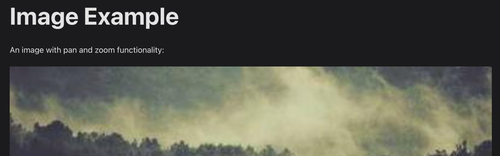
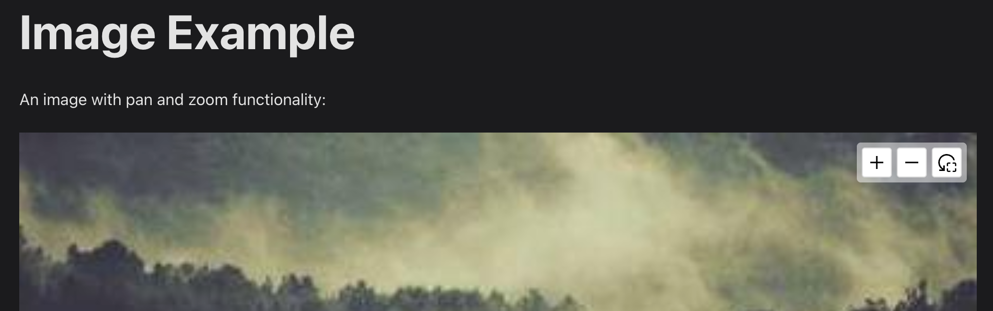
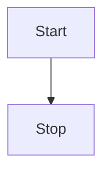

# Configuration

## Default Configuration

To customize the plugin's behavior, add a `zoom` object to the `themeConfig` section of your Docusaurus configuration
file:

```js title="docusaurus.config.js"
module.exports = {
  // ...
  themeConfig: {
    // ...
    zoom: {
      // A list of selectors to look for elements to enable pan and zoom
      // Default: ['div.mermaid[data-processed="true"]', 'div.docusaurus-mermaid-container', '.drawio']
      selectors: ['div.mermaid[data-processed="true"]', 'div.docusaurus-mermaid-container', '.drawio'],

      // Whether to wrap the panzoom items in a div with overflow:hidden
      // This constrains the pan zoom detail into the original container
      // Default: true
      wrap: true,

      // The amount of time to wait in MS before the plugin client module tries to look for
      // and alter pan zoom elements. Some renders take a little bit before they appear in the
      // dom to find.
      // Default: 1000
      timeout: 1000,

      // The toolbar configuration (optional)
      toolbar: {
        // Whether to enable and show a control toolbar with buttons for zoom in, zoom out, and reset
        // Default: true
        enabled: false,

        // The position of the toolbar (top-right, top-left, bottom-right, bottom-left)
        // Default: 'top-right'
        position: 'top-right',

        // The toolbar opacity when the container is not hovered (value between 0 and 1)
        // Default: 0
        opacity: 0,
      },

      // You can also pass any options supported by @panzoom/panzoom
      // See: https://github.com/timmywil/panzoom for available options
    },
  },
  // ...
};
```

## Using `@panzoom/panzoom` options

You can also pass any options supported by [@panzoom/panzoom](https://www.npmjs.com/package/@panzoom/panzoom) to the
`zoom` configuration.

For example, if you want to change the cursor style when hovering over the pan and zoom elements, you can do so like
this:

```js title="docusaurus.config.js"
module.exports = {
  // ...
  themeConfig: {
    // ...
    zoom: {
      // ...
      panzoomOptions: {
        cursor: 'pointer', // Pointer cursor instead of the default move cursor
      },
    },
  },
  // ...
};
```

## Toolbar Configuration

You can customize the toolbar that appears when hovering over the pan and zoom elements. The toolbar provides buttons
for zooming in, zooming out, and resetting the view.

```js title="docusaurus.config.js"
module.exports = {
  // ...
  themeConfig: {
    // ...
    zoom: {
      // ...

      // The toolbar configuration (optional)
      toolbar: {
        // Whether to enable and show a control toolbar with buttons for zoom in, zoom out, and reset
        // Default: true
        enabled: true,

        // The position of the toolbar (top-right, top-left, bottom-right, bottom-left)
        // Default: 'top-right'
        position: 'top-right',

        // The toolbar opacity when the container is not hovered (value between 0 and 1)
        // Default: 0
        opacity: 0,
      },
    },
  },
  // ...
};
```

By default, the toolbar:

- is disabled
- is positioned at the top-right corner of the pan and zoom element
- is hidden when the pan and zoom element is not hovered

Screenshot of the toolbar when the pan and zoom element is not hovered:

<div style={{ border: '1px solid #ccc' }}>
<span></span>
</div>

<br />

Screenshot of the toolbar when hovering over a pan and zoom element:

<div style={{ border: '1px solid #ccc' }}>
<span></span>
</div>

## Selectors

### Default Selectors

By default, pan and zoom functionality is added to the elements matching the following CSS selectors:

1. `div.mermaid[data-processed="true"]` - Processed Mermaid diagrams
2. `div.docusaurus-mermaid-container` - Docusaurus Mermaid containers
3. `.drawio` - Diagrams created with draw.io

### Adding Custom Selectors

Let's say you want to add pan and zoom functionality to specific elements in your Docusaurus site, such as images or div
element, you can define a CSS class in the `selectors` array.

In this example, we will add a custom selector `.panzoom` to enable pan and zoom functionality on elements with that
class, and we'll keep the default selectors as well:

```js title="docusaurus.config.js"
module.exports = {
  // ...
  themeConfig: {
    // ...
    zoom: {
      // ...

      selectors: [
        'div.mermaid[data-processed="true"]',
        'div.docusaurus-mermaid-container',
        '.drawio',
        '.panzoom', // Add a custom selector
      ],
    },
  },
  // ...
};
```

Then, you can apply the `.panzoom` class to any element in your Markdown or MDX files:

```mdx title="example.md"
Below is an example of an with pan and zoom functionality:

<div className='panzoom'>
  
</div>
```

### Excluding Specific Elements

Let's say by default you want to enable pan and zoom functionality on all Mermaid diagrams, but you have specific
diagrams where you do not want this functionality.

One way to achieve this is by adding a class to a parent element of the diagram that you want to disable pan and zoom
on. You can use the :not() pseudo-class in the selector.

Here is an example:

```js title="docusaurus.config.js"
module.exports = {
  // ...
  themeConfig: {
    // ...
    zoom: {
      // ...

      selectors: [
        'div.mermaid[data-processed="true"]:not(.panzoom-exclude *)',
        'div.docusaurus-mermaid-container:not(.panzoom-exclude *)',
        '.drawio',
      ],
    },
  },
  // ...
};
```

Any Mermaid diagram that have an ancestor with the class `panzoom-exclude` will not have pan and zoom functionality
enabled.

````mdx title="example.md"
This Mermaid diagram will have pan and zoom functionality (default behavior):



This Mermaid diagram will not have pan and zoom functionality:

<div className='panzoom-exclude'>
  ```mermaid sequenceDiagram Alice->>John: Hello John, how are you? John-->>Alice: Great! Alice-)John: See you later!
  ```
</div>
````

You can apply a similar logic to any element, not just Mermaid diagrams.
